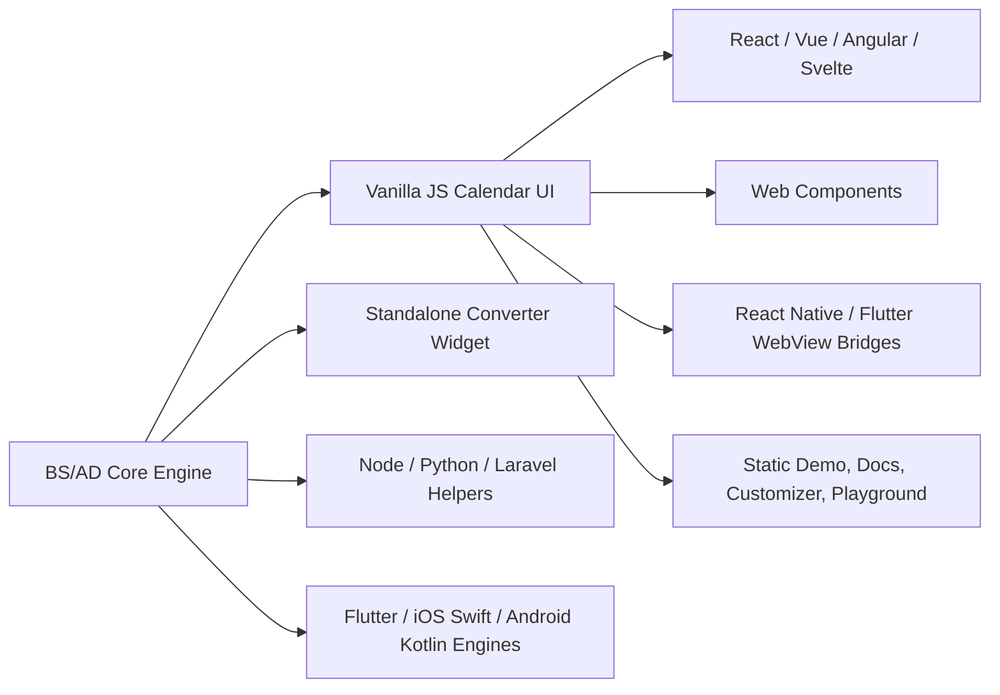
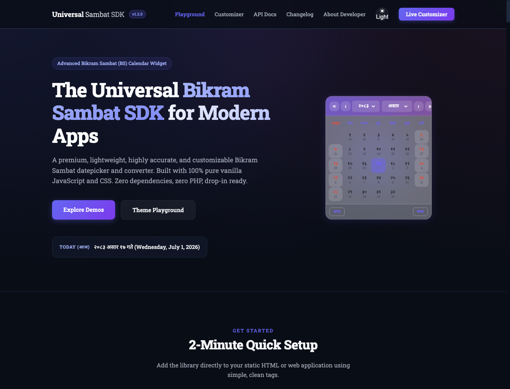
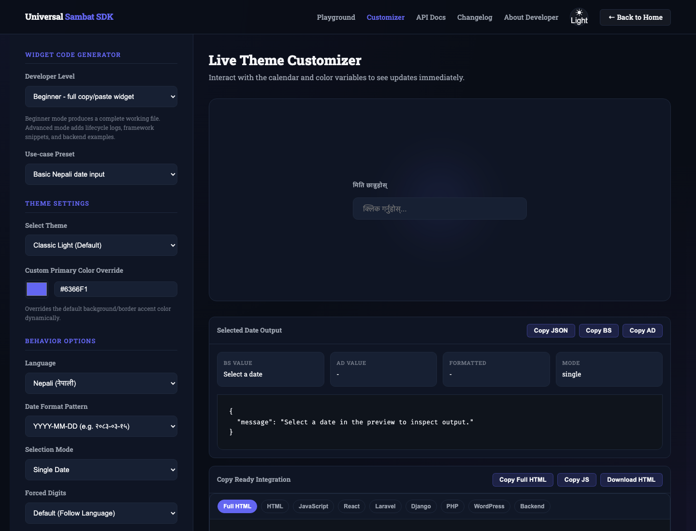
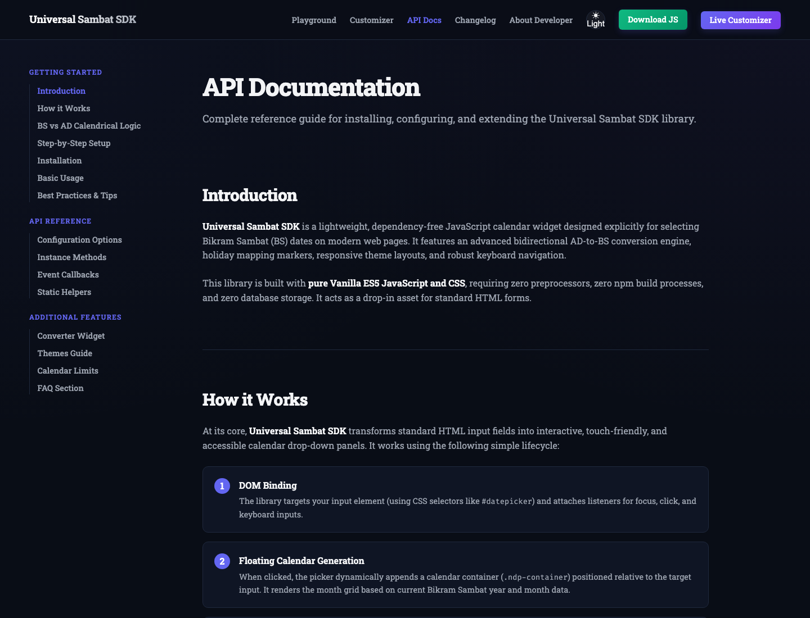
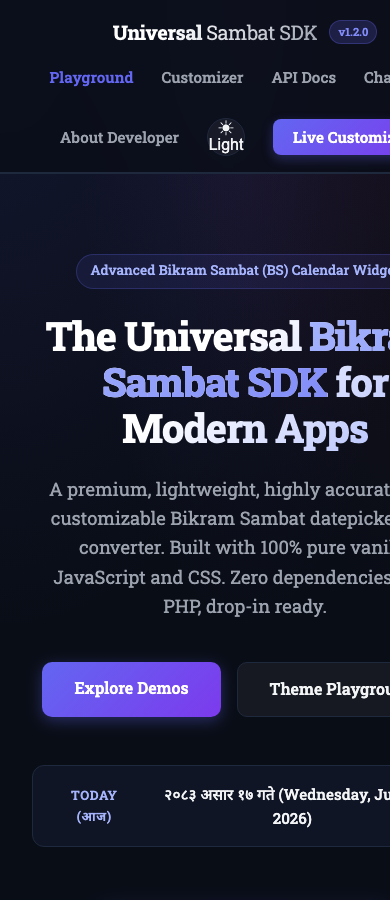
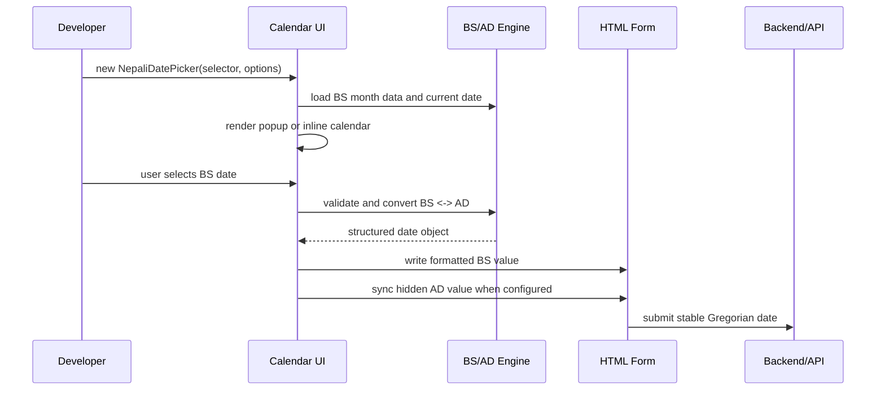
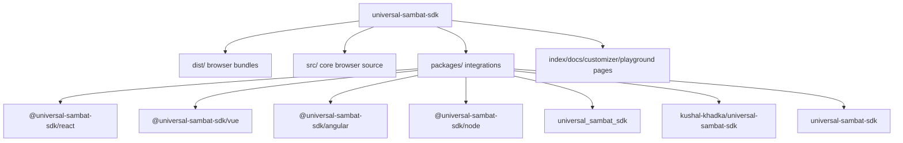
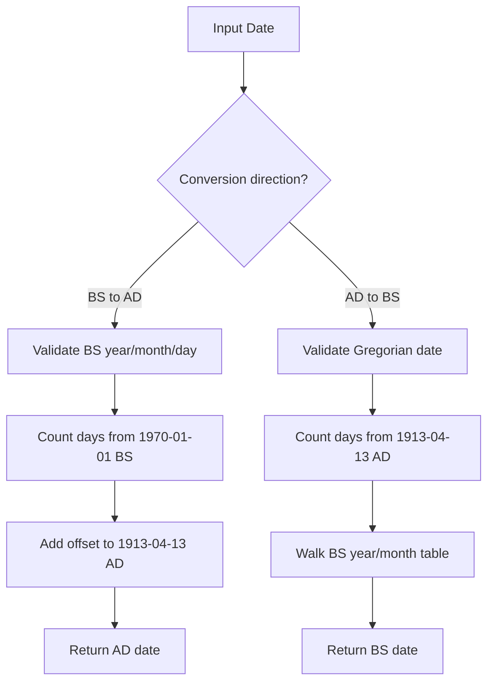

# Universal Sambat SDK

Open-source cross-platform Bikram Sambat date SDK for JavaScript, web UI, backend validation, framework adapters, mobile wrappers, and native integrations.

Universal Sambat SDK gives applications a complete Nepali date layer. It includes a pure BS/AD conversion engine, browser calendar widgets, form-friendly hidden AD exports, React/Vue/Angular/Svelte/Web Component adapters, Node/Python/Laravel helpers, mobile/native package scaffolds, CLI templates, visual themes, and a full static demo site.

[Live demo](https://kushalkhadkaa.github.io/universal-sambat-sdk/) · [API docs](https://kushalkhadkaa.github.io/universal-sambat-sdk/docs.html) · [Customizer](https://kushalkhadkaa.github.io/universal-sambat-sdk/customizer.html)

## Introduction

Most projects in Nepal eventually need to accept dates in Bikram Sambat while still storing or exchanging Gregorian dates with databases, APIs, analytics systems, and international tools. Universal Sambat SDK solves that problem as a reusable date SDK rather than a one-off widget.

It gives users a familiar Nepali calendar interface and gives developers reliable structured data. A selected date can be displayed in Nepali, formatted in English, converted to AD, written to a hidden backend field, used inside a booking workflow, or styled through a custom theme without changing the core library.

The project is designed for public websites, dashboards, booking systems, admin panels, hospital systems, travel flows, event forms, backend services, and any product that needs accurate Nepali date handling.

## SDK Scope

Universal Sambat SDK is organized as one core date engine plus multiple integration surfaces.



Use the core engine when you only need conversion and validation. Use the browser UI when you need form inputs. Use the adapters when your app already lives in a framework or native stack.

## Current Project Screenshots

These images are generated from the current Universal Sambat SDK repository pages: `playground.html`, `customizer.html`, and `docs.html`.

### Playground Home

*Current playground page showing the SDK overview, quick install path, and live calendar preview.*

### Live Customizer

*Current customizer page for theme variables, behavior options, and generated integration code.*

### API Documentation

*Current documentation page covering setup, lifecycle, methods, options, examples, and FAQ content.*

### Mobile Layout

*Current mobile-width playground rendering for the public demo page.*

## What It Does

Universal Sambat SDK provides a browser-ready calendar UI and reusable conversion utilities for the Nepali Bikram Sambat calendar. It lets users select BS dates while giving developers structured date objects, formatted strings, and synchronized AD values for backend systems.

The SDK is useful for:

- Nepali date fields in forms
- hotel check-in and checkout flows
- booking and reservation systems
- hospital admission and discharge dates
- flight departure and return dates
- event start and end dates
- BS to AD converter tools
- Nepali calendar dashboards
- bilingual Nepali/English interfaces
- API validation and normalization
- cross-platform BS date integrations

## Features

- Pure vanilla JavaScript and CSS
- No jQuery, no framework, no build step required
- BS to AD and AD to BS conversion
- Calendar data range from 1970 BS to 2100 BS
- Single, range, and multiple selection modes
- Inline calendar or popup calendar
- Time picker support
- Range presets
- Hidden AD field export
- Nepali and English output
- Devanagari digit support
- Custom date formats
- Minimum and maximum date limits
- Disabled dates and disabled weekdays
- Future-only and past-only selection
- Custom day rendering with `renderDay`
- Holiday, weekend, fiscal year, and Tithi UI support
- Mobile-friendly picker layout
- Keyboard navigation
- 22 built-in themes
- Live customizer for theme and option generation
- Offline-ready local fonts and assets
- MIT licensed

## Lightweight by Design

Universal Sambat SDK is intentionally simple to ship:

- No runtime dependencies
- No jQuery
- No React/Vue/Angular requirement
- No npm install required for browser usage
- No database lookup at runtime
- No remote API call for conversion
- No CDN required
- Works from static hosting

The public integration surface is only two files:

```html
<link rel="stylesheet" href="dist/nepali-datepicker.css">
<script src="dist/nepali-datepicker.js"></script>
```

All calendar data, conversion utilities, UI behavior, themes, and helper APIs are bundled locally. That makes the picker easy to use in static HTML, PHP, Laravel, Django templates, WordPress themes, admin dashboards, and GitHub Pages.

## How It Works

The SDK has four main layers:

1. Calendar data
   Static month-length data defines how many days each BS month contains between 1970 BS and 2100 BS.

2. Conversion utilities
   Utility functions convert dates between BS and AD by counting days from a known reference date.

3. Datepicker UI
   The UI layer binds to an input or container, renders the current BS month, handles navigation and selection, then writes formatted output back to the page.

4. Integrations
   Framework, backend, mobile, and native packages wrap the same calendar concepts for app-specific workflows.

The browser only needs:

```html
<link rel="stylesheet" href="dist/nepali-datepicker.css">
<script src="dist/nepali-datepicker.js"></script>
```

### Graphical Runtime Flow



## Easy to Use

The simplest setup takes three steps:

1. Load the CSS and JavaScript bundle.
2. Add a normal HTML input.
3. Initialize `NepaliDatePicker` with a selector.

```html
<link rel="stylesheet" href="dist/nepali-datepicker.css">

<input type="text" id="date" placeholder="Select Nepali date">

<script src="dist/nepali-datepicker.js"></script>
<script>
  new NepaliDatePicker('#date');
</script>
```

For advanced forms, pass options:

```javascript
new NepaliDatePicker('#date', {
  theme: 'classic-light',
  lang: 'ne',
  mode: 'range',
  showAdDate: true,
  exportAdInput: '#ad-date'
});
```

The same API works for single dates, ranges, multiple selection, inline calendars, date-time pickers, and booking flows.

## Developer Widget Code Generator

The live customizer includes a developer-focused widget generator that helps both junior and senior developers move from demo to production faster.

It provides:

- Beginner and advanced developer modes
- Use-case presets for common workflows
- Live datepicker preview
- Selected date output inspector
- Copyable BS value
- Copyable AD value
- Copyable selected-date JSON
- Full HTML example generator
- JavaScript-only generator
- React snippet
- Laravel Blade snippet
- Django template snippet
- PHP form snippet
- WordPress enqueue/template snippet
- Backend storage recommendation
- Downloadable working `.html` example

Available presets:

- Basic Nepali date input
- Date range picker
- Hotel check-in / checkout
- Restaurant reservation
- Flight departure / return
- Hospital admission / discharge
- Event start / end
- Date of birth / past-only picker
- Future-only booking date
- Inline dashboard calendar
- BS / AD converter widget

The generator is useful because it does not only show a configuration object. It also shows the markup, hidden AD export field, callback structure, framework integration shape, and backend storage approach.

## System Architecture

Universal Sambat SDK is designed around a dependency-free browser runtime and reusable conversion engines. The basic browser integration does not require a server, database, package manager, or runtime framework. The browser loads one CSS bundle and one JavaScript bundle, then the SDK attaches calendar behavior to normal HTML elements.

```text
HTML page
  |
  |-- dist/nepali-datepicker.css
  |     |
  |     |-- base calendar layout
  |     |-- 22 theme definitions
  |     |-- responsive/mobile styles
  |     |-- animation and state classes
  |
  |-- dist/nepali-datepicker.js
        |
        |-- Calendar data layer
        |     |-- BS month length table from 1970 BS to 2100 BS
        |     |-- month names, weekday names, digit maps
        |     |-- holiday/festival metadata
        |
        |-- Utility/conversion layer
        |     |-- BS date validation
        |     |-- AD date validation
        |     |-- BS to AD conversion
        |     |-- AD to BS conversion
        |     |-- formatting and digit conversion
        |
        |-- DatePicker UI layer
        |     |-- input binding
        |     |-- popup/inline rendering
        |     |-- month/year navigation
        |     |-- single/range/multiple selection
        |     |-- time picker, presets, callbacks
        |
        |-- Converter widget layer
              |-- standalone BS/AD conversion panel
              |-- reusable dashboard-style converter UI
```

### Package Architecture



### Runtime Flow

```text
Developer creates input
        |
        v
new NepaliDatePicker('#input', options)
        |
        v
Options are normalized and internal state is prepared
        |
        v
User clicks/focuses input
        |
        v
Picker builds calendar DOM and renders current BS month
        |
        v
User selects date, range, multiple dates, or time
        |
        v
Library validates selection and converts BS <-> AD when needed
        |
        v
Formatted value is written to input
        |
        v
Callbacks run and optional hidden AD field is synchronized
```

### Layer Responsibilities

| Layer | Responsibility | Main Output |
|---|---|---|
| Calendar data | Stores verified BS calendar facts | Month lengths, names, holidays |
| Conversion utilities | Converts and validates BS/AD dates | Date objects and formatted values |
| Picker core | Builds and controls the interactive UI | Calendar popup/inline widget |
| Theme system | Applies visual design through CSS variables | 22 ready-made themes |
| Page assets | Power the demo, docs, and customizer pages | Public showcase website |
| SEO files | Help search engines understand the project | `robots.txt`, `sitemap.xml` |

### Data Flow for a Selected Date

```text
User selects BS date
  -> picker receives year/month/day
  -> min/max/disabled rules are checked
  -> BS date is converted to AD using day-offset calculation
  -> output formatter applies format/language/digit rules
  -> input value is updated
  -> onChange/onRangeChange callback receives structured data
  -> optional exportAdInput receives Gregorian date value
```

### Why This Architecture

The project intentionally keeps the public runtime simple:

- Static files are easy to host on GitHub Pages, shared hosting, Laravel, WordPress, or plain HTML sites.
- No npm build step means users can copy `dist/` directly into a project.
- The BS conversion logic is bundled locally, so the picker works offline.
- CSS themes are separated from date logic, making visual customization safer.
- The customizer and docs pages are separate from the library bundle, so production users only need `dist/`.

### Public Release Architecture

The GitHub release is intentionally organized so users can run the project immediately:

```text
Public website pages
  -> index.html, customizer.html, docs.html, about.html, changelog.html

Reusable library files
  -> dist/nepali-datepicker.css
  -> dist/nepali-datepicker.js

Demo and documentation assets
  -> assets/css/
  -> assets/js/
  -> assets/fonts/
  -> assets/readme/

Search discovery
  -> robots.txt
  -> sitemap.xml
```

Users who only want the browser calendar SDK in their own project need the `dist/` files. Users who want to explore the full demo can open the GitHub Pages site.

## Conversion Algorithm

The BS/AD conversion is lookup-table based, not an approximate formula.

Bikram Sambat month lengths vary by year. Because of that, a simple Gregorian-style leap-year formula is not enough for accurate BS conversion. This library uses verified static BS calendar metadata and a reference epoch.

### Reference Point

The conversion engine uses a known base mapping:

```text
1970-01-01 BS = 1913-04-13 AD
```

### BS to AD

For BS to AD conversion:

1. Validate the BS year, month, and day.
2. Count all days from `1970-01-01 BS` to the selected BS date.
3. Add that day offset to `1913-04-13 AD`.
4. Return the matching Gregorian date object and date parts.

Conceptually:

```text
AD date = base AD date + days elapsed from base BS date
```

### AD to BS

For AD to BS conversion:

1. Validate the AD date.
2. Count days between the selected AD date and `1913-04-13 AD`.
3. Walk forward through the BS calendar data year by year and month by month.
4. Stop when the remaining day count falls inside the current BS month.
5. Return the matching BS year, month, and day.

Conceptually:

```text
days elapsed = AD date - base AD date
BS date = calendar table position at elapsed day count
```

This approach favors correctness over guessing. If a requested date falls outside the supported calendar range, the utility throws or rejects it rather than silently returning a wrong date.

### Conversion Flow



## DatePicker Algorithm

The datepicker UI works through a predictable lifecycle:

1. Bind target
   The constructor receives an input, container, or CSS selector.

2. Normalize options
   Options are merged with defaults. Compatibility aliases such as `dateFormat`, `range`, `multiple`, and `language` are mapped to the current API.

3. Initialize state
   The picker stores current BS year/month, selected date, range state, multiple selections, time values, and language/theme settings.

4. Build calendar DOM
   On open or inline render, the picker creates the calendar shell, header, weekday row, day grid, footer buttons, presets, and optional time controls.

5. Render month grid
   It calculates:
   - first weekday of the BS month
   - number of days in the BS month
   - matching AD date for every BS day
   - disabled state
   - weekend/holiday state
   - selected/range/multiple state
   - custom `renderDay` output

6. Handle user interaction
   Clicks, keyboard events, month navigation, year navigation, presets, time selectors, clear, and today buttons update internal state.

7. Format output
   The selected date is formatted using the configured `format`, `lang`, and `unicodeDates` options.

8. Emit callbacks
   Hooks such as `onChange`, `onRangeChange`, `onOpen`, `onClose`, `onToday`, and `onClear` run after state updates.

9. Sync AD export
   If `exportAdInput` is configured, the picker writes the converted AD value into another form field.

## Installation

Use npm or copy the `dist/` folder into your project.

```bash
npm install universal-sambat-sdk
```

For static HTML, use the bundled files directly:

```html
<link rel="stylesheet" href="dist/nepali-datepicker.css">
<script src="dist/nepali-datepicker.js"></script>
```

Add an input:

```html
<input type="text" id="nepali-date" placeholder="Select Nepali date">
```

Initialize:

```html
<script>
  new NepaliDatePicker('#nepali-date', {
    theme: 'classic-light',
    lang: 'ne',
    format: 'YYYY-MM-DD'
  });
</script>
```

## Quick Start for Production

For a production form, the most common pattern is to display BS to the user and submit AD to the server:

```html
<label for="booking-date">Booking date</label>
<input type="text" id="booking-date" placeholder="Select BS date">
<input type="hidden" id="booking-date-ad" name="booking_date_ad">

<script src="dist/nepali-datepicker.js"></script>
<script>
  new NepaliDatePicker('#booking-date', {
    lang: 'ne',
    format: 'YYYY-MM-DD',
    showAdDate: true,
    exportAdInput: '#booking-date-ad'
  });
</script>
```

This gives the user a Nepali datepicker while keeping the backend value in a standard Gregorian format.

## Technical Step-by-Step Integration

1. Choose the integration surface.
   Use `dist/` for plain HTML, `@universal-sambat-sdk/react` for React, `@universal-sambat-sdk/node` for backend conversion, or the platform package that matches your stack.

2. Load the visual assets.
   Browser widgets need `dist/nepali-datepicker.css`. The conversion helpers alone do not need CSS.

3. Initialize the picker or converter.
   Attach `NepaliDatePicker` to an input, inline container, or custom component wrapper.

4. Decide your storage format.
   For most production apps, display BS to the user and store AD in the database.

5. Configure constraints.
   Add `minDate`, `maxDate`, `futureOnly`, `pastOnly`, `disabledDates`, or `disabledDaysOfWeek` based on the business rule.

6. Connect callbacks.
   Use `onChange`, `onRangeChange`, `onOpen`, `onClose`, and `renderDay` to integrate with your app state.

7. Test edge cases.
   Test month boundaries, unsupported dates, disabled dates, range selection, mobile viewport behavior, and backend AD submission.

## Usage Examples

### Single Date

```javascript
new NepaliDatePicker('#date', {
  mode: 'single',
  theme: 'classic-light',
  lang: 'ne',
  onChange(date) {
    console.log(date.formatted, date.adDate);
  }
});
```

### Date Range

```javascript
new NepaliDatePicker('#range', {
  mode: 'range',
  presets: true,
  showAdDate: true,
  onRangeChange(range) {
    console.log(range.start, range.end);
  }
});
```

### Multiple Dates

```javascript
new NepaliDatePicker('#multiple', {
  mode: 'multiple',
  lang: 'en'
});
```

### Date and Time

```javascript
new NepaliDatePicker('#date-time', {
  enableTime: true,
  format: 'YYYY-MM-DD'
});
```

### Hidden AD Export

```html
<input type="text" id="bs-date">
<input type="hidden" id="ad-date" name="ad_date">

<script>
  new NepaliDatePicker('#bs-date', {
    exportAdInput: '#ad-date'
  });
</script>
```

### Hotel Check-in and Checkout

```javascript
const checkIn = new NepaliDatePicker('#check-in', {
  enableTime: true,
  lang: 'en',
  dateFormat: 'Day Month Year Time 12 hour',
  onChange(date) {
    checkOut.setMinDate({
      year: date.year,
      month: date.month,
      day: date.day
    });
  }
});

const checkOut = new NepaliDatePicker('#check-out', {
  enableTime: true,
  lang: 'en',
  dateFormat: 'Day Month Year Time 12 hour'
});
```

### Custom Day Rendering

```javascript
new NepaliDatePicker('#calendar', {
  inline: true,
  renderDay(day, cell) {
    if (day.day % 10 === 5) {
      cell.style.borderColor = '#6366f1';
      cell.title = 'Custom marker';
    }
  }
});
```

## Core Options

| Option | Type | Default | Description |
|---|---:|---:|---|
| `theme` | string | `classic-light` | Visual theme name |
| `lang` | string | `ne` | `ne` or `en` |
| `mode` | string | `single` | `single`, `range`, or `multiple` |
| `format` | string | `YYYY-MM-DD` | Output format |
| `inline` | boolean | `false` | Render inline instead of popup |
| `showAdDate` | boolean | `true` | Show AD day label in cells |
| `showTodayBtn` | boolean | `true` | Show today button |
| `showClearBtn` | boolean | `true` | Show clear button |
| `minDate` | object | `null` | Minimum selectable BS date |
| `maxDate` | object | `null` | Maximum selectable BS date |
| `disabledDates` | array | `[]` | Specific disabled BS dates |
| `disabledDaysOfWeek` | array | `[]` | Disable weekdays by index |
| `enableTime` | boolean | `false` | Enable time controls |
| `presets` | boolean | `false` | Enable range presets |
| `unicodeDates` | boolean/null | `null` | Force Nepali or English digits |
| `futureOnly` | boolean | `false` | Disable past dates |
| `pastOnly` | boolean | `false` | Disable future dates |
| `exportAdInput` | string/null | `null` | Selector for synced AD output |
| `renderDay` | function/null | `null` | Customize individual cells |

## Public Methods

```javascript
const picker = new NepaliDatePicker('#date');

picker.getDate();
picker.setDate({ year: 2083, month: 3, day: 12 });
picker.getDates();
picker.getRange();
picker.clear();
picker.open();
picker.close();
picker.toggle();
picker.setMinDate({ year: 2083, month: 3, day: 1 });
picker.setTheme('neon-cyberpunk');
picker.setLang('en');
picker.jumpTo(2083, 6);
picker.destroy();
```

## Static Helpers

```javascript
NepaliDatePicker.today();
NepaliDatePicker.bsToAd(2083, 3, 12);
NepaliDatePicker.adToBs(new Date());
NepaliDatePicker.version;

AD2BS('2026-06-26');
BS2AD('2083-03-12');
```

## Built-in Themes

```text
classic-light, classic-dark, nepali-red, ocean-blue, forest-green,
sunset-orange, royal-purple, midnight, glassmorphism, neumorphism,
gradient-aurora, minimal-mono, pastel-soft, corporate-blue,
earthy-terracotta, neon-cyberpunk, material-design, retro-paper,
high-contrast, festive-dashain, mountain-mist, tropical-teal
```

## Project Structure

```text
.
├── index.html
├── customizer.html
├── docs.html
├── about.html
├── changelog.html
├── dist/
│   ├── nepali-datepicker.css
│   └── nepali-datepicker.js
├── assets/
│   ├── css/
│   ├── js/
│   ├── fonts/
│   └── screenshots/
├── robots.txt
├── sitemap.xml
└── LICENSE
```

## Browser Support

Universal Sambat SDK is designed for modern browsers:

- Chrome
- Firefox
- Safari
- Edge
- Opera

## FAQ

### Is this open source?

Yes. Universal Sambat SDK is released under the MIT License.

### Does it need jQuery?

No. The library is pure vanilla JavaScript and CSS.

### Does it need npm or a build system?

No. For normal browser usage, copy `dist/nepali-datepicker.css` and `dist/nepali-datepicker.js` into your project and include them with HTML tags.

### Does it work offline?

Yes. The calendar data, conversion logic, styles, fonts, and widgets are local files. No remote API call is required for date conversion.

### How accurate is the BS/AD conversion?

The conversion uses static BS month-length data and day-offset calculation from a known reference date. It is not a rough year-difference formula.

### What date range is supported?

The included calendar data covers 1970 BS to 2100 BS.

### Can I store AD dates in my database?

Yes. Use `exportAdInput` to synchronize the selected BS date into a hidden AD input field.

### Can I customize the design?

Yes. The library includes 22 themes and a live customizer. Themes are CSS-variable based, so you can override colors without editing the core JavaScript.

### Can I use it for hotel check-in and checkout?

Yes. The picker supports date ranges, time selection, minimum date updates, and booking-specific date-time formats.

### Can I disable past or future dates?

Yes. Use `futureOnly`, `pastOnly`, `minDate`, `maxDate`, `disabledDates`, or `disabledDaysOfWeek`.

### Can I highlight special dates?

Yes. Use the `renderDay(day, cell)` hook to add classes, styles, labels, or tooltips to specific calendar cells.

### Is this only for Nepali language?

No. It supports Nepali and English UI/output, including optional Devanagari digit rendering.

## Search Friendliness

The project includes:

- semantic HTML pages
- canonical URLs
- Open Graph metadata
- Twitter card metadata
- JSON-LD software metadata
- `robots.txt`
- `sitemap.xml`

## License

Released under the MIT License.

Copyright (c) 2026 Kushal Khadka.
